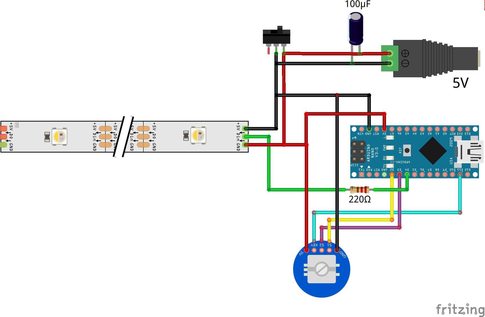

# Strip Lamp

Сontrol the color temperature and brightness of your lamp through the encoder

## Features
- **Brightness control**

    Control brightness through the encoder

    ```c 
    // brightness
    #define BRIGHTNESS_SMALL_STEP 10
    #define BRIGHTNESS_BIG_STEP 50
    #define MAX_BRIGHTNESS 255
    #define MIN_BRIGHTNESS 5
    ```

- **Color temperature control**

    Control color temperature through the encoder with pressed button

    ```c 
    // color temperature
    #define COLOR_SMALL_STEP 1
    #define COLOR_BIG_STEP 5
    #define STARTUP_COLOR_TEMPERATURE 25      // color temperature on startup
    ```

# Scheme



# Libraries
- [FastLED](https://github.com/FastLED/FastLED)
- [EncButton](https://github.com/GyverLibs/EncButton)
