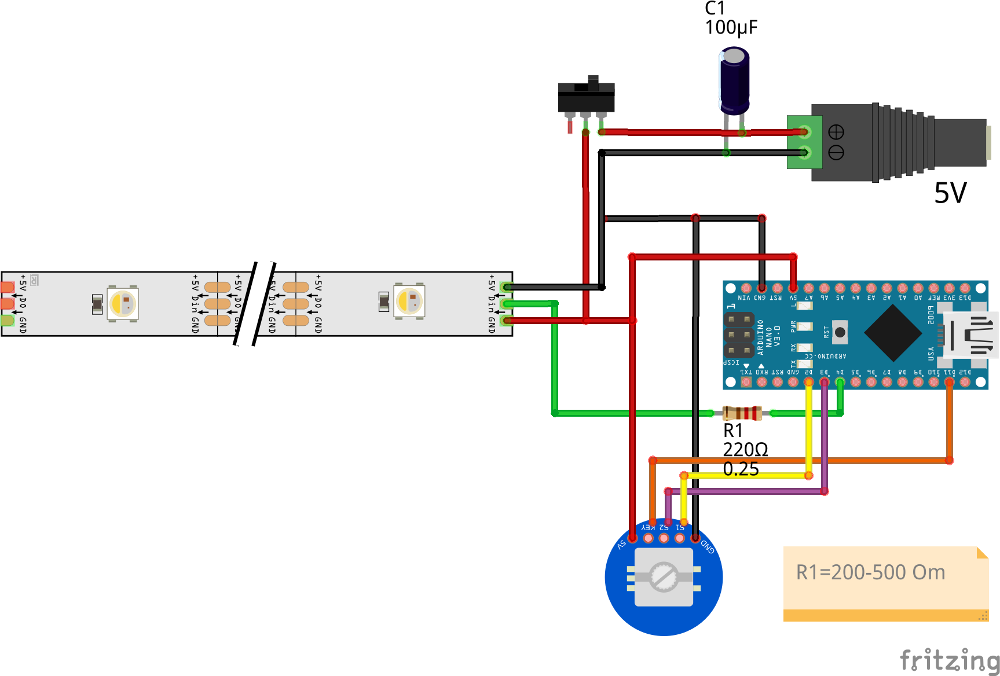

# Strip Lamp

Сontrol the color temperature and brightness of your lamp through the encoder

# Scheme

# Libraries
- [FastLED](https://github.com/FastLED/FastLED)
- [EncButton](https://github.com/GyverLibs/EncButton)
